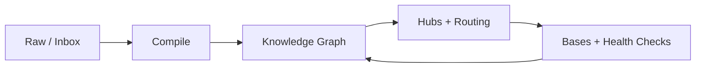

# Obsidian Agentic Vault Skills

Personal skill package for building Obsidian vaults as agent-maintained Markdown knowledge systems.

The core pattern is simple: humans choose what enters, agents compile raw material into a linked wiki, and Obsidian stays the readable frontend.



## Install

Install for Codex:

```bash
npx skills add https://github.com/pariyar07/obsidian-agentic-vault-skill \
  --global \
  --agent codex \
  --skill obsidian-agentic-vault \
  --copy \
  --yes
```

Install for Claude Code:

```bash
npx skills add https://github.com/pariyar07/obsidian-agentic-vault-skill \
  --global \
  --agent claude-code \
  --skill obsidian-agentic-vault \
  --copy \
  --yes
```

Install all skills for all supported agents:

```bash
npx skills add https://github.com/pariyar07/obsidian-agentic-vault-skill \
  --global \
  --agent '*' \
  --copy \
  --yes
```

List available skills:

```bash
npx skills add https://github.com/pariyar07/obsidian-agentic-vault-skill --list
```

## Skills

- `obsidian-agentic-vault` - bootstrap a vault with folders, templates, agent navigation, and Bases.
- `obsidian-ingest-compile` - turn links, documents, brain dumps, and raw inputs into durable notes.
- `obsidian-research-synthesis` - synthesize multi-source research threads and debate hubs.
- `obsidian-vault-maintainer` - run health checks and repair navigability.
- `obsidian-navigation-architect` - design hubs, routing, workstream graphs, templates, and Base/view layers.
- `obsidian-vault-validator` - run deterministic structural checks for YAML, broken links, orphan notes, and unlinked Bases.

## Model

The vault has three layers:

- **Knowledge Graph:** research, concepts, entities, relationships, decisions, and domain workstreams.
- **Operating Graph:** agent instructions, workflows, inbox, processing queue, raw sources, templates, and health checks.
- **View Layer:** Bases, canvases, dashboards, and reports over the Markdown source of truth.

The bootstrap skill includes `assets/templates/Custom View.base` as a generic starting point for domain-specific Base views.

Navigation should stay layered:

```text
00 Index.md = strategic map
Agent/00 Agent Navigation.md = routing map
Folder hubs = detailed maps
Thread hubs = deep topic maps
Bases = dynamic tables
```

## References

- `skills/obsidian-agentic-vault/references/vault-operating-model.md`
- `skills/obsidian-agentic-vault/references/vault-modes.md`
- `skills/obsidian-agentic-vault/references/vault-structure.md`
- `skills/obsidian-agentic-vault/references/maintenance.md`
- `skills/obsidian-agentic-vault/references/knowledge-processing-architecture.md`

## Validation

Run the validator from a vault root:

```bash
ruby /path/to/skills/obsidian-vault-validator/scripts/validate_vault.rb
```

Healthy output should look like:

```text
yaml-ok
broken-wikilinks: 0
true-orphans-md: 0
unlinked-base-files: 0
bloat-warnings: 0
```
