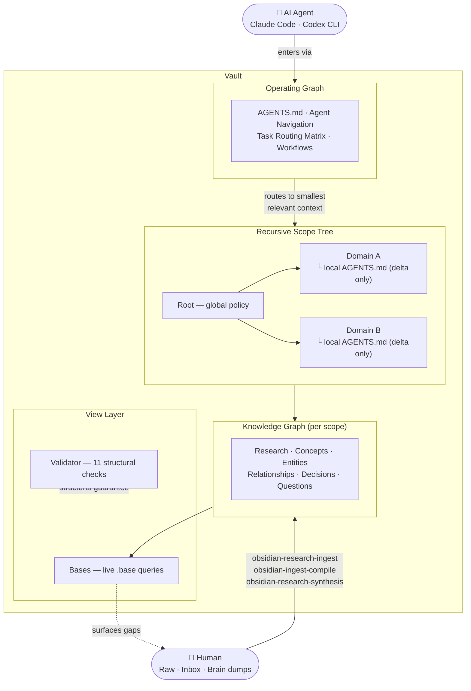
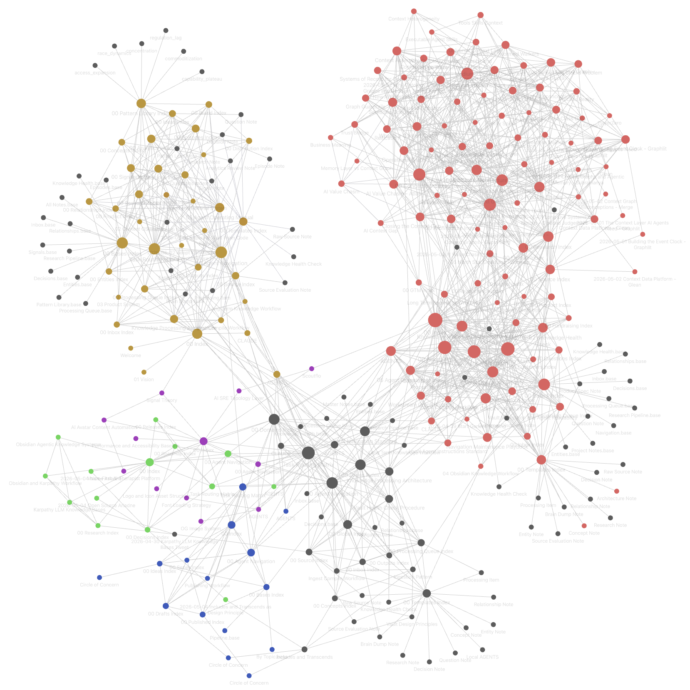

# Ariadne

> In Greek myth, Ariadne gives Theseus the thread that lets him navigate the labyrinth.
> Ariadne gives AI agents a thread through a complex knowledge labyrinth.

An agent skill package for building Obsidian vaults that AI agents can navigate, maintain, and operate reliably. Works with Claude Code, Codex CLI, and any agent runtime that supports the skills protocol.

The core pattern: humans choose what enters, agents compile raw material into a linked wiki, Obsidian is the readable frontend, and Bases are live query views over the Markdown source of truth.

**[Read the origin story →](https://satyampariyar.com/blog/circle-of-concern)**



## In Practice

This is Satyam's vault after several months of active use — research threads, five active project scopes, a published essay scope, and the agent operating graph all wired together.



Each color cluster is a scope. The large hub nodes with many edges are the agent navigation files (`00 Index.md`, `Agent/00 Agent Navigation`, routing matrices). The graph shows what the scope model looks like when it's actually running: dense within boundaries, connected across them through deliberate navigation links.

## Requirements

- Obsidian installed, with filesystem access to the target vault.
- Obsidian Bases enabled in the vault (Settings -> Core plugins -> Bases) if you want the `.base` view files to render inside Obsidian.
- Optional: Obsidian Kanban community plugin if you want visual drag-and-drop Kanban boards.
- Optional: Obsidian Dataview community plugin if you want dynamic Markdown dashboards to render query results.
- Node.js with `npm`/`npx` available for installing skills and running the bundled validator and vault-registration scripts.
- A skills-capable agent runtime, such as Claude Code, Codex CLI, or another runtime that supports the skills protocol.
- Recommended companion pack: [kepano/obsidian-skills](https://github.com/kepano/obsidian-skills), which provides Obsidian mechanics skills such as Markdown, Bases, JSON Canvas, clean Markdown extraction, and Obsidian CLI interaction.

Install the companion Obsidian skills first when your agent does not already have equivalent Obsidian mechanics skills:

```bash
npx skills add https://github.com/kepano/obsidian-skills \
  --global \
  --agent '*' \
  --copy \
  --yes
```

Ariadne itself has no package install step and no external npm dependencies. Its scripts use only built-in Node.js modules.

## Install

Install for all supported agents (Claude Code, Codex CLI, and others):

```bash
npx skills add https://github.com/pariyar07/ariadne \
  --global \
  --agent '*' \
  --copy \
  --yes
```

Install for a specific agent:

```bash
# Claude Code
npx skills add https://github.com/pariyar07/ariadne \
  --global \
  --agent claude-code \
  --copy \
  --yes

# Codex CLI
npx skills add https://github.com/pariyar07/ariadne \
  --global \
  --agent openai \
  --copy \
  --yes
```

List available skills:

```bash
npx skills add https://github.com/pariyar07/ariadne --list
```

## Update

Update globally installed skills:

```bash
npx skills update -g -y
```

Reinstall Ariadne from GitHub when you want to force a fresh copy:

```bash
npx skills add https://github.com/pariyar07/ariadne \
  --global \
  --agent '*' \
  --copy \
  --yes
```

During local Ariadne development, reinstall from your checkout:

```bash
npx skills add /path/to/ariadne \
  --global \
  --agent '*' \
  --copy \
  --yes
```

List installed global skills:

```bash
npx skills list -g
```

Updating skills does not migrate existing vault content. After updating, run the validator against important vaults, and run global discovery doctor if you use machine-level vault discovery:

```bash
node skills/obsidian-vault-validator/scripts/validate_vault.js "/path/to/vault"
node skills/obsidian-agentic-vault/scripts/register_vault.js --agents codex,claude,gemini --doctor
```

## Skills

Start with `obsidian-agentic-vault` to bootstrap a new vault. All other skills operate on an existing vault.

| Skill | Purpose |
| --- | --- |
| `obsidian-agentic-vault` | **Start here** — Bootstrap a new agent-ready vault with folders, navigation, templates, and Bases |
| `obsidian-vault-discovery` | Register existing Obsidian vaults so cold agents can find them from any workspace |
| `obsidian-scope-manager` | Create, promote, import, and nest durable knowledge scopes |
| `obsidian-navigation-architect` | Design hubs, routing, workstream graphs, templates, and view layers |
| `obsidian-ingest-compile` | Turn links, documents, and brain dumps into durable wiki notes |
| `obsidian-research-ingest` | Cold-start research source ingest into the right scope |
| `obsidian-research-synthesis` | Synthesize multi-source research threads and debate hubs |
| `obsidian-research-pipeline` | Add research intake and synthesis infrastructure inside an existing scope |
| `obsidian-workstream-board` | Create and improve Obsidian Kanban boards and Dataview dashboards for durable workstream tracking |
| `obsidian-feature-workstream` | Coordinate important feature work from Ariadne vault context across same-chat, subagent, parallel-chat, OpenSpec, and Superpowers workflows |
| `obsidian-vault-maintainer` | Run health checks and repair navigability drift |
| `obsidian-vault-validator` | Deterministic structural validation — 11 checks, zero-warnings target |

## Weekly Maintenance Automation

Recurring maintenance is best handled as an automation prompt that invokes the existing skills, not as a separate skill. Start with `obsidian-vault-validator`, follow with `obsidian-vault-maintainer`, and only call navigation, ingest, synthesis, Bases, or discovery skills when the weekly run finds drift in those areas.

See `docs/guides/weekly-maintenance-automation.md` for a Codex-ready prompt, Claude Code adaptation notes, subagent boundaries, and the optional durable report variant.

## What's Coming

Ariadne's next direction is cross-domain synthesis and feedback loops.

Today, Ariadne helps agents enter a vault, find the right scope, ingest research, maintain hubs, and validate structure. The next layer is helping agents notice when knowledge in one domain should affect another domain, then returning those connections to the user as useful output.

Planned areas of exploration:

- cross-domain synthesis across scope-level research hubs
- explicit relationship notes for connections between domains
- recurring daily or weekly vault briefs
- stale question resurfacing
- contradiction review across old decisions, beliefs, and newer synthesis

The design constraint stays the same: agents should not need to read the whole vault to be useful. They should follow explicit routes, compare durable syntheses, write back meaningful connections, and keep the Markdown vault as the source of truth.

## How It Works

### Three Layers

Every vault created with Ariadne has three layers:

- **Knowledge Graph** — research, concepts, entities, relationships, decisions, and domain workstreams
- **Operating Graph** — agent instructions (`AGENTS.md`), routing matrices, workflows, intake queues, and templates
- **View Layer** — Bases (`.base` files), canvases, and dashboards as live queries over the Markdown source of truth

### Recursive Scope Model

The vault is a tree of scopes, not a flat folder. The root scope owns global policy. Each child scope inherits parent rules and adds only local deltas.

```text
Vault root (global policy)
├── Agent/            ← global routing and workflows
├── Bases/            ← global view layer
├── Domains/
│   ├── Alpha/        ← child scope (inherits root)
│   │   ├── AGENTS.md ← local deltas only
│   │   ├── Agent/    ← local routing
│   │   └── Bases/    ← scoped views
│   └── Beta/         ← another child scope
```

### Navigation Layers

Agents navigate through a layered structure — no cold reading of raw notes:

```text
00 Index.md               → strategic map
Agent/00 Agent Navigation → routing map
Agent/Task Routing Matrix → task entry selector
Folder hubs               → detailed local maps
Thread hubs               → deep synthesis notes
Bases                     → dynamic inspection layer
```

### Wikilink Resolution

Navigation files (`AGENTS.md`, `00 Index.md`, `Agent/`) always use path-qualified wikilinks so agents arriving cold have zero ambiguity. Content notes may use bare links because agents always arrive via a qualified navigation file, never cold.

The validator resolves wikilinks to real vault files, including Markdown notes, Base files, Canvas files, and attachments. Orphan checks remain Markdown-only.

## Validation

Run the validator from a vault root:

```bash
node /path/to/skills/obsidian-vault-validator/scripts/validate_vault.js "/path/to/vault"
```

A healthy vault reports all zeros:

```text
yaml-ok
broken-wikilinks: 0
true-orphans-md: 0
unlinked-base-files: 0
bloat-warnings: 0
local-base-scope-warnings: 0
local-agents-inheritance-warnings: 0
ambiguous-wikilink-warnings: 0
scope-navigation-warnings: 0
routing-matrix-warnings: 0
base-scope-formula-warnings: 0
```

See `docs/guides/validator.md` for the full counter reference.

## Guides

| Guide | Contents |
| --- | --- |
| `docs/guides/quickstart.md` | Full usage guide — every skill, every scenario, cold-start phrases, skill chains, and common mistakes |
| `docs/guides/global-discovery.md` | Optional machine-level vault registration so cold agents can find local vaults from any folder |
| `docs/guides/weekly-maintenance-automation.md` | Weekly maintenance prompt, Codex setup notes, Claude Code adaptation, and subagent boundaries |
| `docs/guides/validator.md` | Validator counter reference |

## Global Discovery

After bootstrapping a vault, Ariadne can optionally register the vault on the user's machine. For existing vaults, use `obsidian-vault-discovery`.

```bash
node skills/obsidian-agentic-vault/scripts/register_vault.js \
  --vault "/path/to/vault" \
  --name "My Knowledge Vault" \
  --purpose "Long-term project and research knowledge." \
  --agents codex,claude,gemini \
  --primary
```

This creates `~/.ariadne/vaults.json` and `~/.ariadne/vaults.md`, then adds a small marker-managed discovery block to selected global agent instruction files. The block points agents to the registry; it does not copy the whole vault context.

Use this when you want future cold agent sessions, launched from any folder, to find the vault quickly for vague questions about prior projects, meetings, research, decisions, or "what was I working on?"

## References

All reference docs live under `skills/obsidian-agentic-vault/references/`:

| Reference | Contents |
| --- | --- |
| `vault-operating-model.md` | How the three layers interact |
| `vault-modes.md` | Single-scope vs multi-scope vault patterns |
| `vault-structure.md` | Folder conventions and filing rules |
| `maintenance.md` | Health check and repair procedures |
| `knowledge-processing-architecture.md` | Intake → compile → link → index pipeline |
| `recursive-scopes.md` | Scope inheritance, wikilink resolution, child scope patterns |
| `bases-scope-patterns.md` | Base filter patterns and scope formula conventions |

## Contributing

See [CONTRIBUTING.md](CONTRIBUTING.md). Issues and PRs welcome — please read the contributing guide before opening either.

## License

MIT
