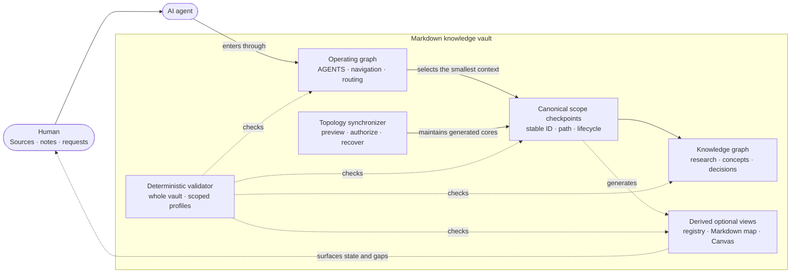

# Ariadne

> In Greek myth, Ariadne gives Theseus the thread that lets him navigate the labyrinth.
> Ariadne gives AI agents a thread through a complex knowledge labyrinth.

An agent skill package for building Markdown knowledge vaults that AI agents can navigate, maintain, and operate reliably. Works with ChatGPT/Codex, Claude Code, and any agent runtime that supports the skills protocol.

The core pattern: humans choose what enters, agents compile raw material into a linked wiki, and plain Markdown remains the source of truth. Obsidian is an optional, recommended frontend; Bases and other Obsidian features are optional view layers.



## Requirements

- A filesystem-accessible folder for the Markdown knowledge vault.
- Node.js with `npm`/`npx` available for installing skills and running the bundled validator and vault-registration scripts.
- A skills-capable agent runtime, such as ChatGPT/Codex, Claude Code, or another runtime that supports the skills protocol.

## Optional Obsidian Frontend

Obsidian is not required for agent workflows. Use it when you want its native reading, editing, backlinks, graph, Canvas, Bases, Kanban, or Dataview experience. Obsidian users may optionally install [kepano/obsidian-skills](https://github.com/kepano/obsidian-skills) for companion Markdown, Bases, Canvas, extraction, and CLI mechanics.

Ariadne has no project dependency installation or build step. Its scripts use only built-in Node.js modules; `npx skills` copies the skill package into supported agent runtimes.

## Install

Install for all supported agents (ChatGPT/Codex, Claude Code, and others):

```bash
npx skills add https://github.com/pariyar07/ariadne \
  --global \
  --agent '*' \
  --copy \
  --yes
```

Install for a specific agent:

```bash
# Claude Code
npx skills add https://github.com/pariyar07/ariadne \
  --global \
  --agent claude-code \
  --copy \
  --yes

# ChatGPT/Codex
npx skills add https://github.com/pariyar07/ariadne \
  --global \
  --agent openai \
  --copy \
  --yes
```

List available skills:

```bash
npx skills add https://github.com/pariyar07/ariadne --list
```

## Update

Update globally installed skills:

```bash
npx skills update -g -y
```

Reinstall Ariadne from GitHub when you want to force a fresh copy:

```bash
npx skills add https://github.com/pariyar07/ariadne \
  --global \
  --agent '*' \
  --copy \
  --yes
```

During local Ariadne development, reinstall from your checkout:

```bash
npx skills add /path/to/ariadne \
  --global \
  --agent '*' \
  --copy \
  --yes
```

List installed global skills:

```bash
npx skills list -g
```

Updating skills does not migrate existing vault content. After updating, run the validator against important vaults, and run global discovery doctor if you use machine-level vault discovery:

```bash
node skills/validator/scripts/validate_vault.js "/path/to/vault"
node skills/vault/scripts/register_vault.js --agents codex,claude,gemini --doctor
```

The research lifecycle skill names changed atomically. Existing copied skills, generated vault instructions, saved prompts, and external schedulers need an explicit migration pass; see [Research Lifecycle Migration](docs/guides/research-lifecycle-migration.md).

Latest release: [Ariadne v0.3.1 — Scope Topology Adoption Fixes](docs/releases/v0.3.1.md).

## Skills

Start with `ariadne:vault` to bootstrap a new vault. Most other skills operate on an existing vault; `ariadne:workspace-instructions` operates on a workspace that may link back to registered Ariadne context.

| Skill | Purpose |
| --- | --- |
| `ariadne:vault` | **Start here** — Bootstrap a new agent-ready vault with folders, navigation, templates, and Bases |
| `ariadne:global-discovery` | Register existing Markdown knowledge vaults so cold agents can find them from any workspace |
| `ariadne:workspace-instructions` | Create or update workspace instruction files and connect workspaces to Ariadne context |
| `ariadne:scope` | Create, promote, import, and nest durable knowledge scopes |
| `ariadne:navigation` | Design hubs, routing, workstream graphs, templates, and view layers |
| `ariadne:knowledge-capture` | Turn links, documents, and brain dumps into durable wiki notes |
| `ariadne:research-ingest` | Route research inputs into an explicitly selected boundary and hand compilation to knowledge capture |
| `ariadne:research-synthesis` | Record synthesis disposition, update inquiries, and prepare supportable promotion candidates |
| `ariadne:research-stewardship` | Audit and safely repair provenance, compilation coverage, stale synthesis, and legacy research drift |
| `ariadne:research-pipeline` | Create a versioned research boundary descriptor and its declared topology inside an existing scope |
| `ariadne:workstream-tracking` | Create and improve Obsidian Kanban boards and Dataview dashboards for durable workstream tracking |
| `ariadne:closeout` | Checkpoint completed work, update durable vault memory, and decide whether a chat can safely close |
| `ariadne:maintenance` | Run health checks and repair navigability drift |
| `ariadne:validator` | Deterministic structural, scope, and schema-gated research validation with a zero-warnings target |

## Weekly Maintenance Automation

Recurring maintenance is best handled as an automation prompt that invokes the existing skills, not as a separate skill. Start with `ariadne:validator`, follow with `ariadne:maintenance`, route research-semantic drift to `ariadne:research-stewardship`, and call `ariadne:research-synthesis` only when an authorized synthesis pass needs a disposition.

See `docs/guides/weekly-maintenance-automation.md` for a Codex-ready prompt, Claude Code adaptation notes, subagent boundaries, and the optional durable report variant.

## What's Coming

Ariadne's next direction is cross-domain synthesis and feedback loops.

Today, Ariadne helps agents enter a vault, find the right scope, ingest research, maintain hubs, and validate structure. The next layer is helping agents notice when knowledge in one domain should affect another domain, then returning those connections to the user as useful output.

Planned areas of exploration:

- cross-domain synthesis across scope-level research hubs
- explicit relationship notes for connections between domains
- recurring daily or weekly vault briefs
- stale question resurfacing
- contradiction review across old decisions, beliefs, and newer synthesis

The design constraint stays the same: agents should not need to read the whole vault to be useful. They should follow explicit routes, compare durable syntheses, write back meaningful connections, and keep the Markdown vault as the source of truth.

## How It Works

### Three Layers

Every vault created with Ariadne has three layers:

- **Knowledge Graph** — research, concepts, entities, relationships, decisions, and domain workstreams
- **Operating Graph** — agent instructions (`AGENTS.md`), routing matrices, workflows, intake queues, and templates
- **View Layer** — Bases (`.base` files), canvases, and dashboards as live queries over the Markdown source of truth

### Recursive Scope Model

The vault is a tree of scopes, not a flat folder. Each adopted scope has an immutable `scope_id`, a canonical path and lifecycle in its exact `00 Index.md`, plus four marker-managed checkpoint surfaces. The root owns global policy; each child inherits parent rules and adds only local deltas. Markdown descriptors and checkpoints are canonical, while registry, map, and Canvas views are derived.

```text
Vault root (global policy)
├── Agent/            ← global routing and workflows
├── Bases/            ← global view layer
├── Domains/
│   ├── Alpha/        ← child scope (inherits root)
│   │   ├── AGENTS.md ← local deltas only
│   │   ├── Agent/    ← local routing
│   │   └── Bases/    ← scoped views
│   └── Beta/         ← another child scope
```

### Navigation Layers

Agents navigate through a layered structure — no cold reading of raw notes:

```text
00 Index.md               → strategic map
Agent/00 Agent Navigation → routing map
Agent/Task Routing Matrix → task entry selector
Folder hubs               → detailed local maps
Thread hubs               → deep synthesis notes
Bases                     → dynamic inspection layer
```

### Wikilink Resolution

Navigation files (`AGENTS.md`, `00 Index.md`, `Agent/`) always use path-qualified wikilinks so agents arriving cold have zero ambiguity. Content notes may use bare links because agents always arrive via a qualified navigation file, never cold.

The validator resolves wikilinks to real vault files, including Markdown notes, Base files, Canvas files, and attachments. Orphan checks remain Markdown-only.

## Validation

Run the validator from a vault root:

```bash
node /path/to/skills/validator/scripts/validate_vault.js "/path/to/vault"
```

Use `--profile scope` for the schema-v1 scope contract, optionally with `--scope "Domains/Product"` for an applicable subtree. Add `--profile research` for schema-v1 research and nearest-routing obligations. Scoped runs inventory the whole vault before filtering results; sibling-only defects do not affect scoped status.

Scope topology changes go through the installed synchronizer. Preview before authorizing its exact content write set:

```bash
node /path/to/skills/validator/scripts/sync_scope_topology.js "/path/to/vault" --check
node /path/to/skills/validator/scripts/sync_scope_topology.js "/path/to/vault" --check --scope "Domains/Product"
```

`Bases/Scope Registry.base` and `Agent/Scope Map.canvas` are fully derived artifacts; the generated block in `Agent/Scope Map.md` is derived too. Do not edit them manually. Regenerate them with the synchronizer, which preserves user content outside managed checkpoint blocks. See the [scope topology migration guide](docs/guides/scope-topology-migration.md) before adopting an existing vault.

A healthy vault reports all zeros:

```text
yaml-ok
broken-wikilinks: 0
true-orphans-md: 0
unlinked-base-files: 0
bloat-warnings: 0
local-base-scope-warnings: 0
local-agents-inheritance-warnings: 0
ambiguous-wikilink-warnings: 0
scope-navigation-warnings: 0
routing-matrix-warnings: 0
base-scope-formula-warnings: 0
scope-adoption-warnings: 0
scope-contract-warnings: 0
scope-map-warnings: 0
research-boundary-warnings: 0
research-provenance-warnings: 0
provenance-cycle-warnings: 0
uncompiled-raw-source-warnings: 0
research-hub-warnings: 0
```

See `docs/guides/validator.md` for the full counter reference.

## Guides

| Guide | Contents |
| --- | --- |
| `docs/guides/quickstart.md` | Full usage guide — every skill, every scenario, cold-start phrases, skill chains, and common mistakes |
| `docs/guides/global-discovery.md` | Optional machine-level vault registration so cold agents can find local vaults from any folder |
| `docs/guides/weekly-maintenance-automation.md` | Weekly maintenance prompt, Codex setup notes, Claude Code adaptation, and subagent boundaries |
| `docs/guides/validator.md` | Validator counter reference |
| `docs/guides/scope-topology-migration.md` | Scope topology adoption, recovery, and rollback guidance |
| `docs/guides/research-lifecycle-migration.md` | Breaking v0.2.0 skill-name and generated-vault migration guidance |
| `docs/releases/v0.3.1.md` | Published v0.3.1 scope topology adoption fix release notes and verification summary |
| `docs/releases/v0.3.0.md` | Published v0.3.0 deterministic scope topology release notes and verification summary |
| `docs/releases/v0.2.1.md` | Published v0.2.1 frontend-neutral positioning release notes |
| `docs/releases/v0.2.0.md` | Published v0.2.0 release notes and verification pointers |

## Global Discovery

After bootstrapping a vault, Ariadne can optionally register the vault on the user's machine. For existing vaults, use `ariadne:global-discovery`.

```bash
node skills/vault/scripts/register_vault.js \
  --vault "/path/to/vault" \
  --name "My Knowledge Vault" \
  --purpose "Long-term project and research knowledge." \
  --agents codex,claude,gemini \
  --primary
```

This creates `~/.ariadne/vaults.json` and `~/.ariadne/vaults.md`, then adds a small marker-managed discovery block to selected global agent instruction files. The block points agents to the registry; it does not copy the whole vault context.

Use this when you want future cold agent sessions, launched from any folder, to find the vault quickly for vague questions about prior projects, meetings, research, decisions, or "what was I working on?"

Use `ariadne:workspace-instructions` when a specific code repository or folder needs local `AGENTS.md`, `CLAUDE.md`, or `GEMINI.md` files that point back to registered Ariadne context. Hermes can use the canonical `AGENTS.md` directly; `.hermes.md` and `HERMES.md` are treated as explicit Hermes-specific overrides rather than default thin adapters. Workspace files should stay small; the vault remains the source of truth.

## References

All reference docs live under `skills/vault/references/`:

| Reference | Contents |
| --- | --- |
| `vault-operating-model.md` | How the three layers interact |
| `vault-modes.md` | Single-scope vs multi-scope vault patterns |
| `vault-structure.md` | Folder conventions and filing rules |
| `maintenance.md` | Health check and repair procedures |
| `knowledge-processing-architecture.md` | Intake → compile → link → index pipeline |
| `recursive-scopes.md` | Scope inheritance, wikilink resolution, child scope patterns |
| `bases-scope-patterns.md` | Base filter patterns and scope formula conventions |

## Contributing

See [CONTRIBUTING.md](CONTRIBUTING.md). Issues and PRs welcome — please read the contributing guide before opening either.

See [PUBLIC_BOUNDARY.md](PUBLIC_BOUNDARY.md) for the public repository boundary and [SECURITY.md](SECURITY.md) for vulnerability reporting.

## License

MIT
