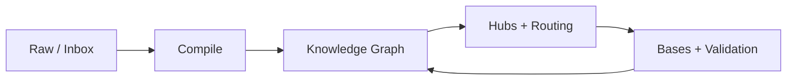

# Ariadne

> In Greek myth, Ariadne gives Theseus the thread that lets him navigate the labyrinth.
> Ariadne gives AI agents a thread through a complex knowledge labyrinth.

A Claude Code skill package for building Obsidian vaults that AI agents can navigate, maintain, and operate reliably.

The core pattern: humans choose what enters, agents compile raw material into a linked wiki, Obsidian is the readable frontend, and Bases are live query views over the Markdown source of truth.



## Install

Install all skills globally for Claude Code:

```bash
npx skills add https://github.com/pariyar07/obsidian-agentic-vault-skill \
  --global \
  --agent claude-code \
  --copy \
  --yes
```

Install for all supported agents:

```bash
npx skills add https://github.com/pariyar07/obsidian-agentic-vault-skill \
  --global \
  --agent '*' \
  --copy \
  --yes
```

List available skills:

```bash
npx skills add https://github.com/pariyar07/obsidian-agentic-vault-skill --list
```

## Skills

| Skill | Purpose |
| --- | --- |
| `obsidian-agentic-vault` | Bootstrap a new agent-ready vault with folders, navigation, templates, and Bases |
| `obsidian-scope-manager` | Create, promote, import, and nest durable knowledge scopes |
| `obsidian-navigation-architect` | Design hubs, routing, workstream graphs, templates, and view layers |
| `obsidian-ingest-compile` | Turn links, documents, and brain dumps into durable wiki notes |
| `obsidian-research-synthesis` | Synthesize multi-source research threads and debate hubs |
| `obsidian-vault-maintainer` | Run health checks and repair navigability drift |
| `obsidian-vault-validator` | Deterministic structural validation — 11 checks, zero-warnings target |

## How It Works

### Three Layers

Every Ariadne vault has three layers:

- **Knowledge Graph** — research, concepts, entities, relationships, decisions, and domain workstreams
- **Operating Graph** — agent instructions (`AGENTS.md`), routing matrices, workflows, intake queues, and templates
- **View Layer** — Bases (`.base` files), canvases, and dashboards as live queries over the Markdown source of truth

### Recursive Scope Model

The vault is a tree of scopes, not a flat folder. The root scope owns global policy. Each child scope inherits parent rules and adds only local deltas.

```text
Vault root (global policy)
├── Agent/            ← global routing and workflows
├── Bases/            ← global view layer
├── Domains/
│   ├── Alpha/        ← child scope (inherits root)
│   │   ├── AGENTS.md ← local deltas only
│   │   ├── Agent/    ← local routing
│   │   └── Bases/    ← scoped views
│   └── Beta/         ← another child scope
```

### Navigation Layers

Agents navigate through a layered structure — no cold reading of raw notes:

```text
00 Index.md               → strategic map
Agent/00 Agent Navigation → routing map
Agent/Task Routing Matrix → task entry selector
Folder hubs               → detailed local maps
Thread hubs               → deep synthesis notes
Bases                     → dynamic inspection layer
```

### Wikilink Resolution

Navigation files (`AGENTS.md`, `00 Index.md`, `Agent/`) always use path-qualified wikilinks so agents arriving cold have zero ambiguity. Content notes may use bare links because agents always arrive via a qualified navigation file, never cold.

## Validation

Run the validator from a vault root:

```bash
node /path/to/skills/obsidian-vault-validator/scripts/validate_vault.js "/path/to/vault"
```

A healthy vault reports all zeros:

```text
yaml-ok
broken-wikilinks: 0
true-orphans-md: 0
unlinked-base-files: 0
bloat-warnings: 0
local-base-scope-warnings: 0
local-agents-inheritance-warnings: 0
ambiguous-wikilink-warnings: 0
scope-navigation-warnings: 0
routing-matrix-warnings: 0
base-scope-formula-warnings: 0
```

See `docs/guides/validator.md` for the full counter reference.

## References

All reference docs live under `skills/obsidian-agentic-vault/references/`:

| Reference | Contents |
| --- | --- |
| `vault-operating-model.md` | How the three layers interact |
| `vault-modes.md` | Single-scope vs multi-scope vault patterns |
| `vault-structure.md` | Folder conventions and filing rules |
| `maintenance.md` | Health check and repair procedures |
| `knowledge-processing-architecture.md` | Intake → compile → link → index pipeline |
| `recursive-scopes.md` | Scope inheritance, wikilink resolution, child scope patterns |
| `bases-scope-patterns.md` | Base filter patterns and scope formula conventions |

## Contributing

See `CONTRIBUTING.md`.

## License

MIT
