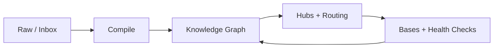

# Obsidian Agentic Vault Skills

A skill package for building Obsidian vaults as agent-maintained Markdown knowledge systems.

The core pattern: humans choose what enters, agents compile raw material into a linked wiki, Obsidian is the readable frontend, and Bases are live query views over the Markdown source of truth.



## Install

Install for Claude Code:

```bash
npx skills add https://github.com/pariyar07/obsidian-agentic-vault-skill \
  --global \
  --agent claude-code \
  --skill obsidian-agentic-vault \
  --copy \
  --yes
```

Install for all supported agents:

```bash
npx skills add https://github.com/pariyar07/obsidian-agentic-vault-skill \
  --global \
  --agent '*' \
  --copy \
  --yes
```

List available skills:

```bash
npx skills add https://github.com/pariyar07/obsidian-agentic-vault-skill --list
```

## Skills

- `obsidian-agentic-vault` — bootstrap a vault with folders, templates, agent navigation, and Bases.
- `obsidian-scope-manager` — create, promote, import, nest, and reorganize durable scopes inside an existing vault.
- `obsidian-ingest-compile` — turn links, documents, brain dumps, and raw inputs into durable notes.
- `obsidian-research-synthesis` — synthesize multi-source research threads and debate hubs.
- `obsidian-vault-maintainer` — run health checks and repair navigability.
- `obsidian-navigation-architect` — design hubs, routing, workstream graphs, templates, and Base/view layers.
- `obsidian-vault-validator` — run deterministic structural checks for YAML, broken links, orphan notes, unlinked Bases, and scope hygiene.

## Model

The vault has three layers:

- **Knowledge Graph:** research, concepts, entities, relationships, decisions, and domain workstreams.
- **Operating Graph:** agent instructions, workflows, inbox, processing queue, raw sources, templates, and health checks.
- **View Layer:** Bases, canvases, dashboards, and reports — live queries over the Markdown source of truth.

For multi-area vaults, model the structure as a recursive scope tree. The root scope owns global policy and shared view layers. Each child scope inherits parent rules and adds only local deltas.

## Recursive Scope Model

Use the root scope for global policy. Use child scopes for durable recurring work at any depth. Child scopes inherit parent rules and add only local deltas. Routing is structural — every promoted scope hub must be linked from `Agent/Task Routing Matrix.md` or agents arriving cold will miss it.

Navigation stays layered:

```text
00 Index.md               = strategic map
Agent/00 Agent Navigation = routing map
Agent/Task Routing Matrix = task entry selector
Folder hubs               = detailed local maps
Thread hubs               = deep synthesis maps
Bases                     = dynamic inspection layer
```

Wikilinks use Obsidian's nearest-scope-first resolution. Navigation files (`AGENTS.md`, `00 Index.md`, `Agent/`) always use path-qualified links. Content notes may use bare links because agents always arrive via a qualified navigation file.

## References

- `skills/obsidian-agentic-vault/references/vault-operating-model.md`
- `skills/obsidian-agentic-vault/references/vault-modes.md`
- `skills/obsidian-agentic-vault/references/vault-structure.md`
- `skills/obsidian-agentic-vault/references/maintenance.md`
- `skills/obsidian-agentic-vault/references/knowledge-processing-architecture.md`
- `skills/obsidian-agentic-vault/references/recursive-scopes.md`
- `skills/obsidian-agentic-vault/references/bases-scope-patterns.md`

## Validation

See `docs/guides/validator.md` for validator usage and implementation notes.

Run the validator from a vault root:

```bash
/path/to/skills/obsidian-vault-validator/scripts/validate_vault.sh
```

Healthy output:

```text
yaml-ok
broken-wikilinks: 0
true-orphans-md: 0
unlinked-base-files: 0
bloat-warnings: 0
local-base-scope-warnings: 0
local-agents-inheritance-warnings: 0
ambiguous-wikilink-warnings: 0
scope-navigation-warnings: 0
routing-matrix-warnings: 0
```

## Sync Installed Skills

This repo is the source of truth. After changing skills, reinstall or sync with:

```bash
npx skills add https://github.com/pariyar07/obsidian-agentic-vault-skill \
  --global \
  --agent '*' \
  --copy \
  --yes
```

Do not edit installed copies under `~/.agents/skills`, `~/.claude/skills`, or similar directories directly.
