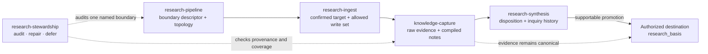

# Ariadne Quickstart Guide

This guide covers everything you can do with Ariadne: from bootstrapping a new vault to running a cold-start ingest in a specific domain. Each section shows the exact words to give a cold agent and which skills handle each job.

---

## Requirements

- A filesystem-accessible folder for the Markdown knowledge vault.
- Node.js with `npm`/`npx` available. Ariadne uses `npx` for skill installation and Node.js for the validator and global-discovery registration script.
- A skills-capable agent runtime, such as ChatGPT/Codex, Claude Code, or another runtime that supports the skills protocol.

Ariadne's scripts use only built-in Node.js modules, so there is no `npm install` step for this repository.

## Optional Obsidian Frontend

Obsidian is not required for agent workflows. Use it for its native note, backlink, graph, Canvas, Bases, Kanban, or Dataview interface. Obsidian users may optionally install [kepano/obsidian-skills](https://github.com/kepano/obsidian-skills) for companion mechanics.

---

## What You Need to Say

Vaults created or maintained with Ariadne are designed so a cold agent — one that has never seen your vault — can orient, route, and act correctly from a single instruction. The pattern is:

> **verb + optional scope + optional material**

Examples:
- `"Research intake https://example.com"` → asks for a domain if needed, then routes into the right research pipeline
- `"Capture this link into OCG"` → routes directly to OCG capture workflow
- `"Synthesize the context graph research thread"` → routes to OCG synthesis
- `"Add a new scope for customer discovery"` → routes to scope creation
- `"Run a vault health check"` → routes to maintenance
- `"Create a weekly vault maintenance automation"` → uses the public automation prompt template
- `"Bootstrap a new vault for my gym training"` → routes to vault creation
- `"Initialize workspace instructions"` → creates or updates workspace-level instructions and optional Ariadne context links

---

## Skill Map

| What you want to do | Skill to invoke | Trigger phrase |
| --- | --- | --- |
| Create a new vault from scratch | `ariadne:vault` | "Bootstrap a new vault for..." |
| Register, update, or repair global discovery | `ariadne:global-discovery` | "Make this vault discoverable" / "Register this vault globally" / "Repair Ariadne discovery" |
| Create or update workspace instructions | `ariadne:workspace-instructions` | "Initialize workspace instructions" / "Connect this repo to Ariadne context" |
| Add a new domain or scope | `ariadne:scope` | "Add a scope for..." / "Create a domain for..." |
| Add research infrastructure inside a domain | `ariadne:research-pipeline` | "Add a research pipeline to..." |
| Cold-start research source intake | `ariadne:research-ingest` | "Research intake..." / "Save this research..." |
| Capture a link, article, or brain dump | `ariadne:knowledge-capture` | "Capture this..." / "Add this to..." |
| Synthesize multiple sources | `ariadne:research-synthesis` | "Synthesize the ... research" / "Update the ... thread" |
| Audit or repair research lifecycle drift | `ariadne:research-stewardship` | "Audit the ... research boundary" / "Repair research provenance" |
| Redesign navigation or routing | `ariadne:navigation` | "Redesign navigation for..." / "Add a workstream for..." |
| Create or improve a work board or dashboard | `ariadne:workstream-tracking` | "Create a Kanban for..." / "Make a dashboard for..." / "Improve this board" |
| Close or checkpoint meaningful work | `ariadne:closeout` | "Run Ariadne closeout" / "Checkpoint this work" / "Can I close this chat?" |
| Run health checks and repair | `ariadne:maintenance` | "Run a vault health check" / "Fix navigation drift" |
| Validate structure deterministically | `ariadne:validator` | "Validate the vault" / "Check for broken links" |

---

## Scenario 1: New Vault From Scratch

**What to say:**
> "Bootstrap a new vault for [purpose] at [path]"

**What happens:**
1. `ariadne:vault` creates the base folder structure, `AGENTS.md`, `CLAUDE.md`, `00 Index.md`, `Agent/` navigation files, `Bases/`, `Templates/`, intake folders, and mode-specific folders.
2. The agent explicitly offers machine-level registration or repair through `ariadne:global-discovery` when discovery is absent or stale, so future cold agents can discover this vault from outside the vault.
3. You get a vault that a cold agent can navigate immediately.

**When to use:** First time setting up any vault. Works for research, startups, personal life systems, content operations, engineering, or any other purpose.

**Scale choices:**
- Small vault (personal topic, early research): minimal structure — `Raw/Sources/`, `Inbox/`, `Research/`, `Concepts/`, `Questions/`, `Decisions/`, `Outputs/`
- Medium vault (active project, startup): adds `Agent/` nav files, `Entities/`, `Relationships/`, `Bases/`, `Processing Queue/`, mode-specific folders
- Large vault (multiple recurring workstreams): promotes each workstream into a child scope with its own hub, routing, and optional local rules

**Optional global discovery:**

If you want agents launched from any folder on your machine to find this vault for vague long-term-context questions, register it:

```bash
node skills/vault/scripts/register_vault.js \
  --vault "/path/to/vault" \
  --name "My Knowledge Vault" \
  --purpose "Long-term project and research knowledge." \
  --agents codex,claude,gemini \
  --primary
```

This writes or refreshes `~/.ariadne/vaults.json`, `~/.ariadne/vaults.md`, and tiny marker-managed pointers in selected global agent files. See `docs/guides/global-discovery.md`.

---

## Scenario 2: Register an Existing Vault For Global Discovery

**What to say:**
> "Make this vault discoverable to agents"
> "Register my existing vault globally"
> "Make agents find this vault from anywhere"

**What happens:**
1. `ariadne:global-discovery` checks the target path for Ariadne entry files.
2. It creates or updates `~/.ariadne/vaults.json` and `~/.ariadne/vaults.md`.
3. It optionally updates selected global agent instruction files with tiny marker-managed pointers.
4. Future cold agents can read the registry first, then enter the vault through the listed cold-start entry order.

**When to use:** You skipped registration during vault creation, imported an older vault, changed machines, want to repair global discovery later, or need to refresh marker blocks after Ariadne ships newer discovery rules.

**Command:**

```bash
node skills/vault/scripts/register_vault.js \
  --vault "/path/to/vault" \
  --name "My Knowledge Vault" \
  --purpose "Long-term project and research knowledge." \
  --agents codex,claude,gemini \
  --primary
```

To unregister a vault later:

```bash
node skills/vault/scripts/register_vault.js \
  --vault "/path/to/vault" \
  --agents codex,claude,gemini \
  --remove
```

To check global discovery health without writing files:

```bash
node skills/vault/scripts/register_vault.js \
  --agents codex,claude,gemini \
  --doctor
```

---

## Scenario 3: Add a Domain Scope to an Existing Vault

**What to say:**
> "Add a scope for [domain name] — it will [describe the recurring job]"

**What happens:**
1. `ariadne:scope` reads the root `AGENTS.md` and `Agent/Task Routing Matrix.md`.
2. Creates the scope folder, hub, local `AGENTS.md` (delta only), routing row, parent/child nav links.
3. If the scope will ingest raw material, creates `Raw/Sources/`, `Inbox/`, `Processing Queue/`, and a local `Agent/Ingest Compile Workflow.md`.
4. Updates root `Bases/*.base` scope formulas so notes in the new scope appear correctly in global views.
5. Validates — `routing-matrix-warnings: 0` and `base-scope-formula-warnings: 0` confirm it's fully wired.
6. If the parent vault is not globally registered or discovery is stale, the agent offers `ariadne:global-discovery` for the parent vault. Scope creation does not add scope-specific global discovery rules.

**When to use:** Adding a new project, content brand, research area, or life domain to an existing vault that already has the root layer.

**Scope inheritance rules:**
- Root `AGENTS.md` applies everywhere. Domain `AGENTS.md` adds only local deltas — never repeats global rules.
- Each domain scope can have its own `Concepts/`, `Research/`, `Decisions/` etc. — these are domain-specific, separate from the root `Concepts/` (which holds vault-wide design principles).

---

## Scenario 4: Add a Research Pipeline Inside a Domain

**What to say:**
> "Add a research pipeline to [domain]"
> "Set up research intake and synthesis for [domain]"

**What happens:**
1. `ariadne:research-pipeline` reads the scope hub, local agent navigation, routing matrix, existing research structure, and applicable instructions.
2. Maps and adopts existing structure before creating the minimum missing topology and one canonical `type: research-boundary` descriptor. Folder names are local choices; folder ancestry does not establish boundary membership.
3. Adds source, compiled research, inquiry, synthesis, ingest-workflow, routing, and optional thread/Base entrypoints only when the recurring workflow needs them.
4. Wires routing rows so future source intake and synthesis start from the smallest useful context set.
5. Validates the resulting structure.

**When to use:** A domain already exists, but research is still just a folder or a few notes. Use this before recurring source ingest or research sprints.

**Scale choices:**
- Small domain: research index, source index, synthesis note, thread hub, ingest workflow, routing rows.
- Active research domain: add concepts, entities, relationships, questions, templates, and local `Research Pipeline.base`.
- Mature domain: add health-check coverage and more local Bases when metadata inspection helps.

---

## Scenario 5: Cold-Start Research Intake

**What to say:**
> "Research intake https://example.com"
> "Save this research source"

**What happens:**
1. `ariadne:research-ingest` reads the root routing layer and active domain registry.
2. It requires the target scope or research boundary to be named or confirmed in the current turn and constructs a closed write set.
3. It checks whether the target boundary has a research pipeline.
4. If the pipeline is missing, it invokes `ariadne:research-pipeline` first.
5. It uses `ariadne:knowledge-capture` to capture raw source metadata and compile a source-backed research note.
6. When synthesis may be warranted, it asks `ariadne:research-synthesis` to record an explicit disposition; ingest does not make that judgment itself.

**When to use:** You are entering a cold agent session with a source link or research material and do not want to remember the vault routing rules.

**What gets created or updated:**
- `Raw/Sources/YYYY-MM-DD Source Title.md` when raw capture is useful
- `Research/Source Title.md` for compiled source-backed understanding
- synthesis/thread hubs, concepts, entities, relationships, and questions when the source warrants it

---

## Scenario 6: Direct Ingest Into a Specific Domain

**What to say:**
> "Capture this link into [domain]" or "Add this to [domain] research"

**Cold start routing chain** (what the agent does automatically):
1. Reads root `AGENTS.md` → sees the read-first list including `Agent/Task Routing Matrix.md`
2. Reads `Agent/Task Routing Matrix.md` → finds explicit row for "Shared link or source material for [domain]"
3. Reads domain `AGENTS.md` → gets local scope boundary and routing rules
4. Reads domain `Agent/Task Routing Matrix.md` → finds "Shared link or article" row → reads local `Agent/Ingest Compile Workflow.md`
5. Executes the handoff chain: classify and capture raw evidence → compile a research note → ask `ariadne:research-synthesis` for a disposition only when current understanding may be affected → link from the authorized hub

**What gets created:**
- `Raw/Sources/YYYY-MM-DD Source Title.md` — timestamped raw capture with metadata
- `Research/Source Title.md` — compiled synthesis note with source claims and interpretation separated
- Updates to relevant concept notes, entity notes, synthesis hubs, and research index

**If research infrastructure doesn't exist yet:** `ariadne:research-ingest` reports `pipeline_state: missing` and invokes `ariadne:research-pipeline` only when the required topology is inside the confirmed write set. `ariadne:knowledge-capture` does not silently create research topology.

**If you don't name a domain or research boundary:** If no target is named or confirmed, make zero writes and ask which research boundary should receive the material. Write to a root research boundary only when the user explicitly names or confirms that root boundary in the current turn.

---

## Scenario 7: Synthesize a Research Thread

**What to say:**
> "Synthesize the [topic] research thread"
> "Update the [domain] research synthesis with recent sources"

**What happens:**
1. `ariadne:research-synthesis` reads the boundary descriptor, research hub, inquiries, current synthesis, and thread hub.
2. Gathers compiled research notes — does not re-read raw sources unless compiled notes are insufficient.
3. Records exactly one disposition: `changed`, `confirmed`, `contradicted`, `superseded`, `no-update`, or `needs-review`.
4. Updates the inquiry history, synthesis, and thread hub only inside the authorized write set; downstream promotion requires a separately confirmed destination.

**When to use:** After ingesting multiple sources on the same topic. After a research sprint. When you want a single synthesis note that a future cold agent can read first instead of opening every source.

**Cross-scope synthesis:** Name or confirm a parent research boundary and its exact write set before combining evidence across domains. A parent includes child research only through descriptor-declared `rollup_boundaries`; folder ancestry alone is not authorization or membership. Link to canonical child evidence instead of duplicating it.

---

## Scenario 8: Redesign Navigation or Add a Workstream

**What to say:**
> "Add a workstream for [topic] inside [domain]"
> "The [folder] hub is too long — split it"
> "Wire up routing for [recurring task]"

**What happens:**
1. `ariadne:navigation` reads the vault navigation layer.
2. Creates or updates: folder hub, thread hub, routing row in `Agent/Task Routing Matrix.md`, Base if metadata inspection helps, local `AGENTS.md` if specialized rules are needed.
3. Calls out bloat signals proactively: entry files acting as tables of contents, hubs too long to scan, recurring workstreams with no routing row.

**When to use:** When a folder has grown enough to need its own map. When a recurring task type has no routing row. When navigation drift makes the vault harder to traverse.

---

## Scenario 9: Create Or Improve Workstream Tracking

**What to say:**
> "Create a Kanban board for [workstream]"
> "Create a board and dashboard for [scope]"
> "Improve this existing board"

**What happens:**
1. `ariadne:workstream-tracking` reads the target scope hub, local agent instructions, navigation, and routing matrix.
2. It creates or updates `Kanban/<Board Name>.md` with Obsidian Kanban-compatible Markdown.
3. It uses consistent task metadata such as `[area:: ...]` and `[priority:: high|medium|low]` so Dataview dashboards can query cards.
4. When useful, it creates `Dashboards/<Board Name> Dashboard.md` with Dataview task and note rollups.
5. It updates `Kanban/00 Kanban Index.md`, dashboard indexes, and scope navigation links when the board becomes a recurring route.

In a multi-scope vault, if the current prompt does not name the target scope/domain/customer/project/workstream, the agent should ask for confirmation before writing to a board, even when search finds a likely existing board. Prior conversation, current working directory, and active skills do not count as confirmation.

**Plugin note:** The board remains readable Markdown without plugins. Obsidian Kanban is required for visual drag-and-drop board rendering. Obsidian Dataview is required for dynamic dashboard query rendering.

**When to use:** Evaluation plans, implementation boards, QA boards, roadmap shaping, release tracking, customer discovery, or any recurring workflow where state should stay visible inside the vault.

---

## Scenario 10: Health Check

**What to say:**
> "Run a vault health check"
> "Check for broken links and stale content"

**Two tools work together:**

`ariadne:maintenance` — reads the vault, checks for:
- raw sources never compiled
- orphan notes with no links
- stale inbox/queue/output buildup
- hubs missing links, Bases missing scope filters
- local AGENTS.md files repeating parent policy

`ariadne:validator` — deterministic CLI check for structure, recursive scopes, and schema-gated research contracts:
```bash
node /path/to/skills/validator/scripts/validate_vault.js "/path/to/vault"
```
Target: every counter in the healthy output is `0`. See the validator guide for the canonical counter list.

See `docs/guides/validator.md` for the full counter reference.

---

## Scenario 11: Weekly Maintenance Automation

**What to say:**
> "Create a weekly vault maintenance automation"
> "Run Ariadne maintenance once a week"

**What it should be:** a scheduled prompt that invokes existing skills, not a new skill. Use `ariadne:validator` first, then `ariadne:maintenance`, then conditional repair skills only when the run finds drift.

**Recommended output:** keep the weekly result in the automation chat or run output by default. Write durable vault notes only for real fixes, unresolved follow-ups, or an explicitly requested dated health report.

See `docs/guides/weekly-maintenance-automation.md` for the copy-paste prompt, Codex setup notes, Claude Code adaptation notes, and subagent boundaries.

---

## Scenario 12: Cold Start in an Existing Vault

If you open a new agent session and want it to orient fast:

**What to say:**
> "Read the vault context and tell me what's here"

**What the agent reads** (in order):
1. `AGENTS.md` — scope inheritance rules and global policy
2. `00 Global Index.md` — strategic map
3. `Agent/00 Agent Navigation.md` — routing map
4. `Agent/Task Routing Matrix.md` — task entry selector
5. `Domains/00 Domains Index.md` — scope registry

That's the full cold-start context. The agent should not read more until it knows which task to do.

If the session starts outside the vault and the vault has been registered globally, the agent should first read `~/.ariadne/vaults.md`, choose the relevant vault, then follow the entry order above.

If several registered vaults look plausible, the agent should show the top matches with short reasons and ask before creating, updating, or filing artifacts.

Inside a selected multi-scope vault, write actions still need a current-turn explicit target. If the user asks to add, create, update, file, or track something without naming the domain, customer, project, or workstream in the current prompt, the agent should search for likely homes only to prepare a confirmation question, then ask before editing. Search hits, a single likely match, existing matching cards, prior conversation, current working directory, and active skills are not confirmation.

---

## Skill Chains: Common Combinations

### New vault → first capture

```
ariadne:vault   → creates vault structure
ariadne:research-ingest → first research source enters the right scope
ariadne:validator → confirms structure is clean
```

### New scope → ready for ingest

```
ariadne:scope   → creates scope, hub, routing, intake infrastructure
ariadne:research-ingest → first research source enters the new scope
ariadne:validator → confirms routing-matrix-warnings: 0, base-scope-formula-warnings: 0
```

### Existing scope → research pipeline

```
ariadne:research-pipeline → creates research hubs, local intake, routing, optional Bases
ariadne:research-ingest   → first source enters the scope
ariadne:knowledge-capture    → compiles the source once the scope is known
ariadne:research-synthesis → records disposition and updates synthesis after multiple sources
ariadne:validator   → confirms structure is wired
```

### Research sprint → synthesis



```
ariadne:research-ingest    (×N sources, with a named or confirmed boundary)
ariadne:knowledge-capture     (×N sources, if scope is known)
ariadne:research-synthesis → inquiry disposition + synthesis note + thread hub
ariadne:research-stewardship → audit provenance, compilation coverage, and research drift
```

### Navigation drift repair

```
ariadne:maintenance    → identifies what's drifting
ariadne:navigation → fixes hubs, routing, Bases
ariadne:validator     → confirms all counters back to 0
```

### Recurring workstream tracking

```
ariadne:navigation → confirms the workstream belongs in the scope route
ariadne:workstream-tracking     → creates or improves Kanban board and optional dashboard
ariadne:validator      → confirms links remain valid
```

### Work completion closeout

```
ariadne:closeout → checks completion, selects durable artifacts, updates the target scope when warranted
conditional repair skills → knowledge capture, research synthesis, workstream tracking, navigation, maintenance, or validator only when needed
```

### Periodic vault maintenance

```
ariadne:validator  → find structural issues
ariadne:maintenance → find content/navigation issues
ariadne:knowledge-capture   → process any stale raw/inbox items
```

### Weekly maintenance automation

```
ariadne:validator    → deterministic baseline and final check
ariadne:maintenance   → stale queues, routing drift, and repair triage
conditional repair skills   → navigation, knowledge capture, research stewardship, research synthesis, Bases, or global discovery only when needed
```

---

## What Each Folder Does

| Folder | Purpose |
| --- | --- |
| `Raw/Sources/` | Timestamped raw captures — articles, tweets, PDFs, repos. Never modified after capture. |
| `Inbox/` | Rough human input, brain dumps, unstructured notes. Always temporary. |
| `Processing Queue/` | Items that need triage, compilation, or follow-up. |
| `Research/` | Source-backed compiled synthesis. Claims separated from interpretation. |
| `Concepts/` | Reusable mental models and definitions. One note per concept. |
| `Entities/` | Durable objects: people, companies, products, platforms. |
| `Relationships/` | Durable connections between entities that deserve explicit explanation. |
| `Decisions/` | Dated commitments with context and rationale. |
| `Questions/` | Unresolved questions and future research prompts. |
| `Outputs/` | Generated artifacts: briefs, memos, slide drafts, diagrams. File back into wiki if durable. |
| `Agent/` | Agent instructions, routing matrices, workflows, health check procedures. |
| `Bases/` | `.base` view files — live queries over Markdown metadata. Not the source of truth. |
| `Kanban/` | Markdown-backed workstream boards for implementation, evaluation, QA, roadmap, or recurring project state. |
| `Dashboards/` | Dataview dashboards that roll up tasks, notes, QA records, and workstream metadata. |
| `Templates/` | Reusable note shapes. |
| `Archive/` | Inactive or superseded material. |

Root `Concepts/` (in multi-scope vaults) holds vault-wide design principles. Domain scopes each keep their own `Concepts/` for domain-specific ideas.

---

## Common Mistakes

**Putting domain content at the root.** Root is global operating layer only. Domain work belongs inside `Domains/<name>/`.

**Ingesting without naming a scope.** Always tell the agent which domain the material belongs to. If you're unsure, use the root intake queues and route later.

**Creating child scopes preemptively.** A scope should emerge from recurring use, not from planning. If a folder has no recurring workflow yet, keep it as a plain folder.

**Repeating global rules in local `AGENTS.md`.** Local files add deltas only. Repeating root rules breaks the inheritance model and triggers `local-agents-inheritance-warnings`.

**Using Bases as the source of truth.** Bases are live queries. The Markdown files are the actual knowledge base. Never put durable content only in a Base.

**Letting raw sources pile up without compiling.** Every raw capture should eventually become a compiled research note, concept, decision, or question. Raw-only material is a maintenance debt.
