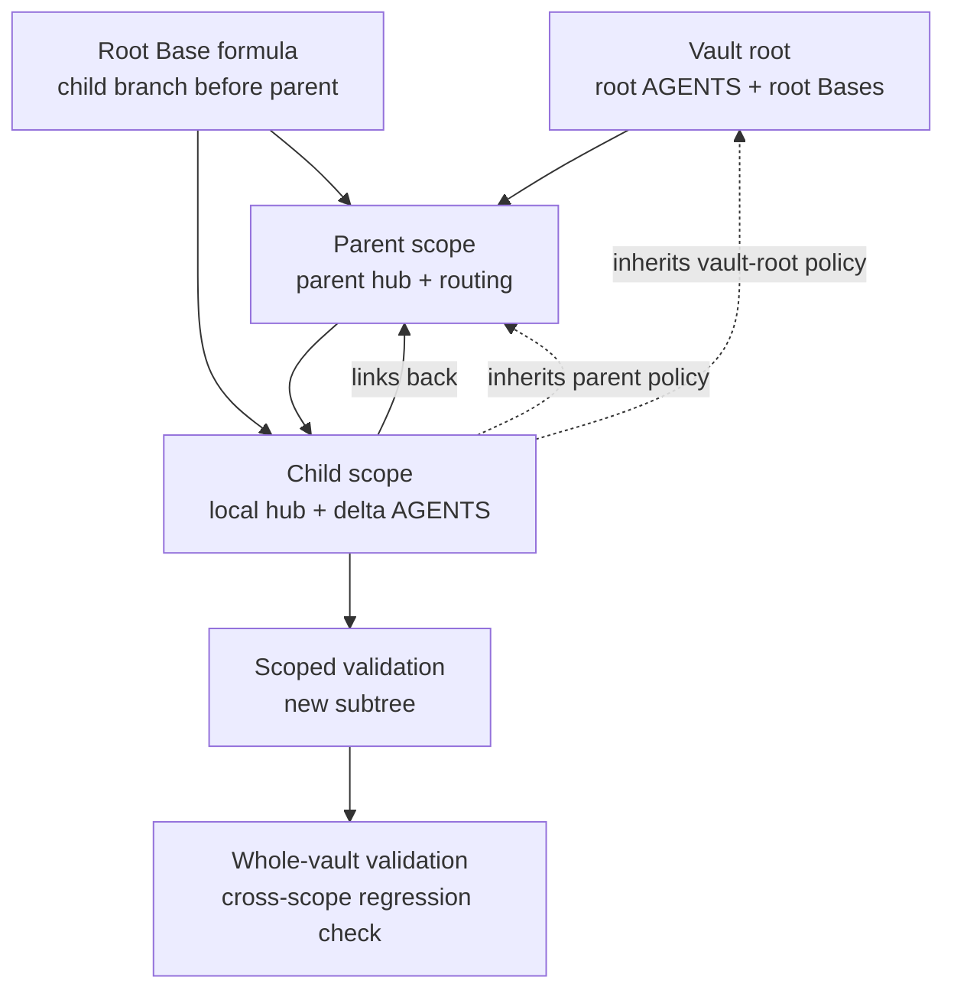

# Recursive Scopes

An agentic Obsidian vault is a recursive scope tree.

## Terms

- `root scope` - the vault-level operating scope.
- `scope` - any durable work area at any depth.
- `parent scope` - the nearest scope above the current one.
- `child scope` - a nested scope below the current one.

## Scope Promotion

A folder becomes a scope only when repeated work needs a durable route. Promote conservatively:

All topology lifecycle operations use the validator-owned `sync_scope_topology.js` and the exact [scope-operation-request.md](../../scope/references/scope-operation-request.md) contract. Audit first with zero writes; mutations require a current-turn target confirmation and the complete disclosed `allowed_write_paths`. Generated artifacts and generated marker blocks are engine-owned.

1. Create or update the scope hub.
2. Link child scope from parent navigation.
3. Link parent scope from child hub.
4. Add task-routing coverage.
5. Add local `AGENTS.md` only for local rules.
6. Add local templates only for repeated note shapes.
7. Add local Bases only for metadata/status inspection.
8. Add health-check coverage when the scope can decay.

## Inheritance

Parent rules are inherited. Child files should say what is different locally.

Good local `AGENTS.md`:

```markdown
This file explicitly inherits the vault-root `AGENTS.md` and the nearest parent-scope `AGENTS.md`.
It only adds rules for this scope.
```

Bad local `AGENTS.md`:

```markdown
Keep notes as plain Markdown.
Use YAML frontmatter.
Do not read the whole vault.
```

Those are parent/root rules and should not be repeated.

## Wikilink Resolution Across Scopes

Bare wikilinks are safe for humans — Obsidian resolves them at runtime using nearest-scope-first. Agents reading raw files do not have the runtime, so they must apply the same algorithm explicitly:

1. Look for the file in the same folder as the note containing the link.
2. If not found, walk toward the vault root, preferring the closest match.
3. If still ambiguous, prefer the path-qualified form and flag it.

**Two-tier rule:**

- Navigation files (`AGENTS.md`, `00 Index.md`, `Agent/` folder) — always path-qualified. These are agent entry points; zero ambiguity is required.
- Content notes (research, concepts, episodes, etc.) — bare links are fine. Agents always arrive at content via a qualified navigation file, never cold.

Multi-scope vaults will have duplicate filenames (`AGENTS.md`, `00 Index.md`, `CLAUDE.md`). Path-qualified navigation links are what make agent traversal deterministic across scope boundaries.

## Bases

Root Bases inspect across scopes and include `formula.scope`.
Local Bases must include a folder-scope filter matching their scope path.

Root Base scope formulas are first-match classifiers. Put a nested child's `file.inFolder()` branch before its parent branch:

```yaml
scope: 'if(file.inFolder("Domains/Ariadne/Evaluation"), "Ariadne Evaluation", if(file.inFolder("Domains/Ariadne"), "Ariadne", "Global"))'
```

Adding the child after the parent is structurally present but semantically ineffective because the parent branch absorbs it.

## Nested-Scope Wiring



Run scoped validation first so defects owned by the new child are unambiguous. Then run whole-vault validation and distinguish new regressions from unrelated warnings that already existed elsewhere.
