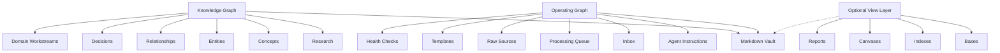
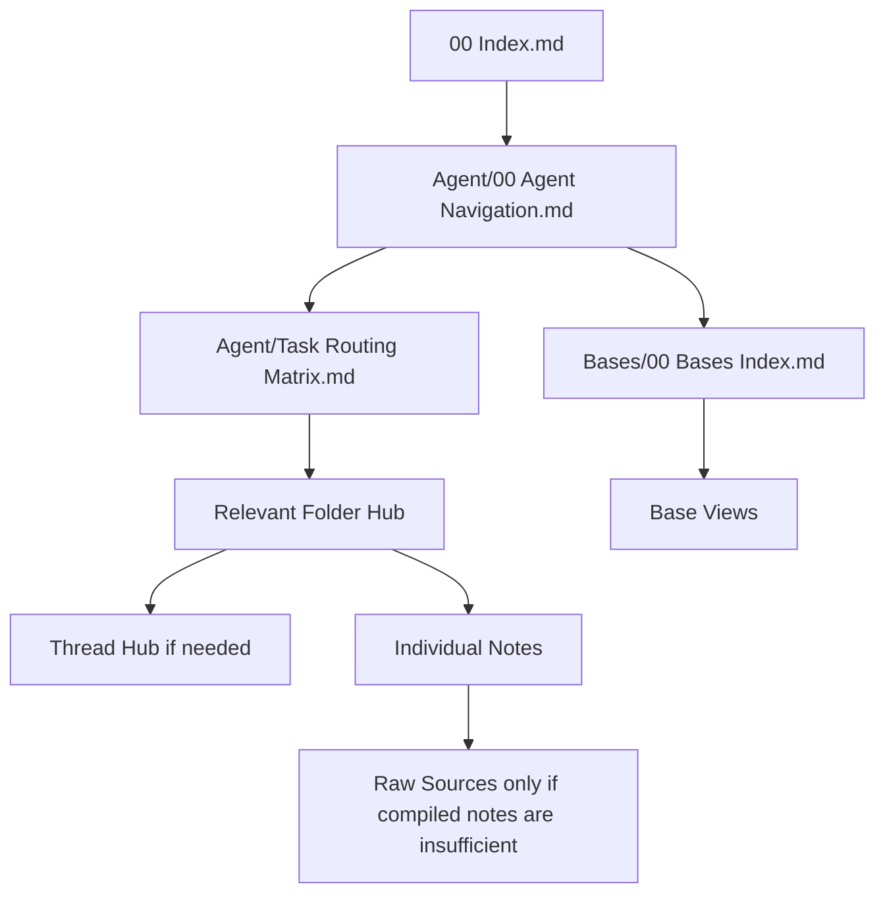
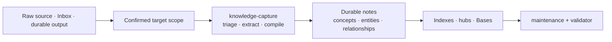
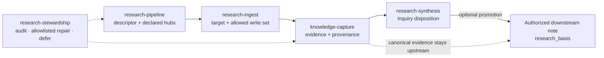

# Vault Operating Model

Use this reference when explaining or designing an agent-maintained Markdown knowledge vault. Obsidian is an optional frontend and view layer.

The goal is not a visually dense graph. The goal is a vault that stays traversable as raw sources, notes, decisions, projects, and outputs grow over time.

## Core Model

The vault has three layers:



### Knowledge Graph

The knowledge graph contains durable meaning:

- compiled research
- reusable concepts
- durable entities
- relationship notes
- decisions
- domain-specific workstreams such as product, sales, training, recipes, or finance

It answers: what do we know, believe, question, and decide?

### Operating Graph

The operating graph keeps the vault usable:

- `Agent/`
- `Templates/`
- `Inbox/`
- `Processing Queue/`
- `Raw/`
- `Raw/Sources/`
- `Outputs/`
- health-check reports

It answers: how should humans and agents operate the vault?

### Optional View Layer

The optional view layer inspects the Markdown source of truth:

- `Bases/`
- `Bases/00 Bases Index.md`
- Obsidian Canvas files
- dashboards
- generated reports

Bases are not the source of truth. They are database-like views over notes and metadata.

### Custom Bases

Create a custom Base when a repeated workflow needs a filtered view, not just a static hub.

Examples:

- sales pipeline by account, stage, owner, next follow-up
- training metrics by exercise, program, date, body part
- recipes by ingredient, cuisine, meal type, rating
- research sources by status, source type, claim quality

Start from `assets/templates/Custom View.base`, rename it, adjust filters/order, then link it from `Bases/00 Bases Index.md`.

## Navigability Model

Use this mental model:

```text
00 Index.md = strategic map
Agent/00 Agent Navigation.md = routing map
Folder hubs = detailed maps
Thread hubs = deep topic maps
Bases = dynamic tables
```

This prevents entry files from becoming giant tables of contents.

## Folder Index Rule

Create a folder index when a folder becomes a durable work area.

Use:

```text
Top-level index = one per durable workstream
Nested index = only when a subfolder becomes a recurring workflow
Thread hub = when a topic becomes an ongoing argument or synthesis
Base = when dynamic filtering or status inspection helps
```

Examples:

```text
Sales/00 Sales Index.md
Sales/Accounts/00 Accounts Index.md
Sales/Calls/00 Calls Index.md
Sales/Objections/00 Objections Index.md
```

```text
Engineering/00 Engineering Index.md
Engineering/Architecture/00 Architecture Index.md
Engineering/Incidents/00 Incidents Index.md
Engineering/Runbooks/00 Runbooks Index.md
```

Do not add nested indexes for every small folder. Add them when recurring use, note volume, or agent traversal requires a local map.

## Proactive Bloat Signals

Agents should proactively call out navigability drift when they encounter it.

Signals include:

- `00 Index.md` starts acting like a full table of contents instead of a strategic map.
- `Agent/00 Agent Navigation.md` lists too much detail instead of routing to hubs.
- A folder has many durable notes but no `00 ... Index.md` hub.
- A folder hub is too long to scan and should be split into sub-hubs or a Base.
- A recurring workstream exists but has no route in `Agent/Task Routing Matrix.md`.
- A Base exists but is not linked from `Bases/00 Bases Index.md`.
- Raw sources, inbox items, or outputs are accumulating without compilation.
- Open questions are scattered in project notes instead of promoted into `Questions/`.

When an agent sees these signals, it should briefly tell the user what is drifting and propose a focused maintenance action. If the current task already involves navigation or maintenance, the agent should fix the issue directly when safe.

## Local Agent Instructions

Some workstreams need local operating rules that are more specific than the global vault instructions.

Use an optional folder-level `AGENTS.md` when a folder has specialized workflow, metadata, naming, or completion rules. Agents should check for a local `AGENTS.md` when they enter a durable workstream folder. If no local file exists, continue with the root `AGENTS.md`, agent navigation, and the folder hub.

Examples:

```text
Sales/AGENTS.md
Engineering/AGENTS.md
Customers/AGENTS.md
Research/AGENTS.md
Product/AGENTS.md
```

Do not create local `AGENTS.md` files for every folder by default. Add one when global rules are too generic for the local workflow.

Local `AGENTS.md` files can define:

- what belongs in the folder
- required frontmatter fields
- local workflow
- local templates
- local Bases
- what counts as done
- local bloat/drift signals
- naming conventions

If an agent repeatedly needs extra user guidance inside a folder, that is a signal to propose a local `AGENTS.md` or update the folder hub.

### Navigation Flow



Agents should not read the whole vault by default. They should route by task, open the smallest useful hub, then follow relevant links.

## General Capture Flow



The human curates what enters. Agents compile raw material into a linked Markdown wiki. Obsidian is an optional, recommended readable frontend.

A Processing Queue is useful when material needs deferred follow-up, but it is not a mandatory hop for every capture.

## Research Lifecycle Flow

Research is boundary-aware and uses a closed write set rather than folder-name assumptions.



## Scale Levels

### Small Vault

Useful for early research, a small project, or a personal topic.

Minimum useful structure:

- `00 Index.md`
- `AGENTS.md` or `CLAUDE.md`
- `Raw/Sources/`
- `Inbox/`
- `Research/`
- `Concepts/`
- `Questions/`
- `Decisions/`
- `Outputs/`

### Medium Vault

Useful for active projects, startups, learning systems, or operating areas.

Add:

- `Agent/00 Agent Navigation.md`
- folder hubs
- `Processing Queue/`
- `Entities/`
- `Relationships/`
- `Bases/`
- health checks
- mode-specific workstreams

### Large Vault

Useful when multiple recurring workstreams exist.

Add workstream graphs only when repeated use needs a durable route. Each workstream graph should have:

- folder or home area
- `00 ... Index.md` hub
- task-routing row
- optional templates
- optional Base
- health-check coverage

## Workstream Examples

### Research

```text
Source -> Claim -> Research Note -> Concept -> Synthesis -> Decision
```

Typical folders:

- `Raw/Sources/`
- `Research/`
- `Claims/` if useful
- `Concepts/`
- `Entities/`
- `Relationships/`
- `Questions/`
- `Decisions/`

### Sales

```text
Lead -> Account -> Contact -> Pain -> Opportunity -> Objection -> Follow-up -> Decision
```

Typical folders:

- `Sales/`
- `Accounts/`
- `Contacts/`
- `Opportunities/`
- `Calls/`
- `Objections/`
- `Follow Ups/`
- `Playbooks/`

### Engineering

```text
System -> Component -> Change -> Incident/Risk -> Runbook -> Decision
```

Typical folders:

- `Engineering/`
- `Architecture/`
- `Components/`
- `Incidents/`
- `Runbooks/`
- `Risks/`
- `Decisions/`

### Startup

Typical workstreams:

- `Product/`
- `Architecture/`
- `Customers/`
- `Market/`
- `GTM/`
- `Fundraising/`
- `Roadmap/`

### Gym / Training

```text
Goal -> Program -> Workout -> Exercise -> Set/Metric -> Review -> Adjustment
```

Typical folders:

- `Training/`
- `Programs/`
- `Exercises/`
- `Nutrition/`
- `Metrics/`
- `Injuries/`
- `Reviews/`

### Cooking

```text
Recipe -> Ingredient -> Technique -> Meal Plan -> Feedback -> Revision
```

Typical folders:

- `Recipes/`
- `Ingredients/`
- `Techniques/`
- `Meal Plans/`
- `Equipment/`
- `Nutrition/`
- `Sources/`

### Personal Life

```text
Area -> Goal -> Habit/System -> Log -> Review -> Decision
```

Typical folders:

- `Areas/`
- `Goals/`
- `Habits/`
- `Journal/`
- `Health/`
- `Finance/`
- `Admin/`
- `Reviews/`

## Design Rule

The folder names can change by domain. The navigability pattern should not:

- start from global entry
- route through agent navigation
- use folder hubs for local maps
- use thread hubs for deep topics
- use Bases for dynamic inspection
- use health checks to stop decay
